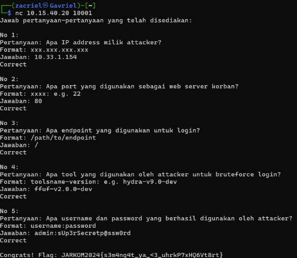

# Jarkom-Modul-1-IT09-2024

| Nama | NRP |
|---------|---------|
| Gavriel Pramuda Kurniaadi | 5027221031  |
| Stephanie Hebrina Mabunbun Simatupang | 5027221069  | 

## Daftar isi
- [Jarkom-Modul-1-IT09-2024](#jarkom-modul-1-it09-2024)
  - [1. Creds](#1-creds)
  - [2. Evidence](#2-evidence)
  - [3. Fuzz](#3-fuzz)
  - [4. ATM or ATP or FTP](#4-atm-or-atp-or-ftp)
  - [5. How Many Packets?](#5-how-many-packets)
  - [6. Trace Him](#6-trace-him)
  - [7. Malwaew](#7-malwaew)
  - [8. Malwleowleo](#8-malwleowleo)
  - [9. Whoami](#9-whoami)
  - [10. Secret](#10-secret)

## 1. Creds


<br/>
File : evidence.pcap
<br/>
Maksud soal : Kita diminta untuk mencari Username FTP yang digunakan oleh attacker & Password FTP yang digunakan oleh attacker. 
<br />
**Cara pengerjaan:**
1. Memfilter ftp && frame contains " Login " artinya untuk mencari yang Login saja, kemudian resultnya hanya keluar 1 yang succesfull

2. Kemudian klik Follow > TCP Stream, akan muncul seperti ini 

3. Kemudian akan muncul USER dan PASS nya


**Jika dimasukan ke netcat maka akan ketemu flagnya**


## 2. Evidence

<br/>
File : challenge.pcapng
<br/>
Maksud soal : Kita diminta untuk mencari informasi tentang cara pelaku bisa masuk ke dalam perusahaan nanomate.
<br />
**Cara pengerjaan:**

1. Melakukan follow pada salah satu stream TCP dan didapatkan informasi mengenai domain dan web server korban.

2. Kemudian, dilakukan pencarian endpoint yang digunakan untuk login sebagai user biasa dengan melakukan filter http. Ditemukan ada banyak sekali endpoint ```/app/includes/process_login.php```, kemudian dicoba untuk submit dan jawabannya benar.

3. Terakhir, dilakukan pencarian email dan password yang berhasil digunakan untuk login sebagai user biasa. Dilakukan sorting dengan menekan kata "Info" untuk mempermudah pencarian email dan password pada "302 Found". Ditemukan juga ada kalimat menarik, yaitu Invalid Username or Password.

4. Dilakukan follow HTTP dan ditemukan ada kalimat Login Successful pada ```tcp.stream eq 1240``` sehingga berhasil ditemukan email dan passwordnya.


**Jika dimasukan ke netcat maka akan ketemu flagnya**


## 3. Fuzz

<br/>
File : capture.pcap
<br/>
Maksud soal : Kita diminta untuk menganalisis network traffic ini untuk melacak attackernya
<br />
**Cara pengerjaan:**

1. Terlihat bahwa terdapat POST request dari IP 10.33.1.154 kepada IP 172.20.0.2, maka dapat disimpulkan bahwa IP attacker adalah 10.33.1.154 dan IP korban adalah 172.20.0.2.

2. Kemudian, dilakukan pencarian port dari web server korban dengan mengecek detail packet dari IP korban ke IP attacker. Ditemukan terdapat pengiriman data dari port 80 ke port 1264 sehingga port dari web server korban adalah 80.

3. Dilakukan follow pada salah satu packet yang berisi POST request dan ditemukan bahwa attacker melakukan POST pada endpoint /. Ditemukan juga tool yang digunakan, yaitu Fuzz Faster U Fool v2.0.0-dev atau disingkat ffuf-v2.0.0-dev.

4. Untuk mencari username dan password yang berhasil ditemukan attacker, dilakukan pencarian menggunakan fitur "Find a Packet" dengan icon kaca pembesar dan memasukkan string 302 Found.

5. Dilakukan follow terhadap packet tersebut, dicari string 302 Found, dan ditemukan kredensial user yang berhasil digunakan attacker.


**Jika dimasukan ke netcat maka akan ketemu flagnya**


## 4. ATM or ATP or FTP

<br/>
File : ftp.pcap
<br/>
Maksud soal : Kita diminta untuk mencari password yang berhasil didapatkan oleh hacker setelah melakukan bruteforce login ftp
<br />
**Cara pengerjaan:**
1. Memfilter ftp && frame contains " Login " artinya untuk mencari yang Login saja, kemudian resultnya hanya keluar 1 yang successful

2. Kemudian klik Follow > TCP Stream, akan muncul seperti ini 


**Jika dimasukan ke netcat maka akan ketemu flagnya**


## 5. How Many Packets?

<br/>
File : ftp.pcap
<br/>
Maksud soal : Kita diminta untuk menghitung total attempt login(bruteforce) yang dilakukan oleh hacker
<br />
**Cara pengerjaan:**
1. Memfilter ftp && frame contains " Login " artinya untuk mencari data yang pernah Login

2. Kemudian di kanan bawah ada tulisan "Displayed : 934", artinya yang total attemp login adalah 934 kali


**Jika dimasukan ke netcat maka akan ketemu flagnya**


## 6. Trace Him

<br/>
File : ftp.pcap
<br/>
Maksud soal : Kita diminta untuk mencari alamat IP Attacker
<br />
**Cara pengerjaan:**
1. Langsung dapat terlihat IP dari attackernya, yaitu 10.30.3.4, dibuktikan dengan permintaan untuk mengakses user adminJarkom kepada IP 10.15.40.20.


**Jika dimasukan ke netcat maka akan ketemu flagnya:**


## 7. Malwaew

<br/>
File : infected.zip
<br/>
Maksud soal : Diminta untuk menganalisis network traffic salah satu komputer yang terkena malware dan menemukannya
<br/>
**Cara pengerjaan:**
1. Pada folder infected, diberikan file keylog.txt. Kemudian membuka Edit -> Preferences -> Protocols -> TLS dan memasukkan file tadi ke dalam (Pre)-Master-Secret log filename.

2. Melakukan filter http dan ditemukan file mencurigakan, yaitu invest_20.dll

3. Download file dengan membuka File -> Export Objects -> HTTP

4. Mengecek informasi tentang file tersebut dengan command ```file invest_20.dll``` dan ditemukan bahwa file tersebut merupakan file executable

5. Mengecek hash SHA256 dari file tersebut


**Jika dimasukan ke netcat maka akan ketemu flagnya**


## 8. Malwleowleo

<br/>
File : evidence.pcap
<br/>
Maksud soal : Kita diminta untuk mencari nama malware yang dikirim oleh attacker melalui ftp
<br />
**Cara pengerjaan:**
1. Memfilter ftp && saat scroll akan ada Request: STOR m4L1c10us_W4re.c


**Jika dimasukan ke netcat maka akan ketemu flagnya**


## 9. Whoami

<br/>
File : evidence.pcap
<br/>
Maksud soal : Kita diminta untuk menemukan identitas attacker
<br />
**Cara pengerjaan:**
1. Melakukan filter pada tcp dan ditemukan sebuah string unik pada stream ke-7.

2. Dilakukan decode pada string tersebut dalam base64 dan ditemukan nama seseorang.


**Jika dimasukan ke netcat maka akan ketemu flagnya:**


## 10. Secret

<br/>
File : evidence.pcap
<br/>
Maksud soal : Kita diminta untuk mencari file lainnya selain dari file malware
<br />
**Cara pengerjaan:**
1. Memfilter ftp-data

2. Klik yang STOR Mirza.jpg > File > Export Object > FTP-Data

3. Kemudian Save gambarnya ke file
 
4. Saat dibuka gambarnya, akan muncul jawabannya :D


**Jika dimasukan ke netcat maka akan ketemu flagnya:**

