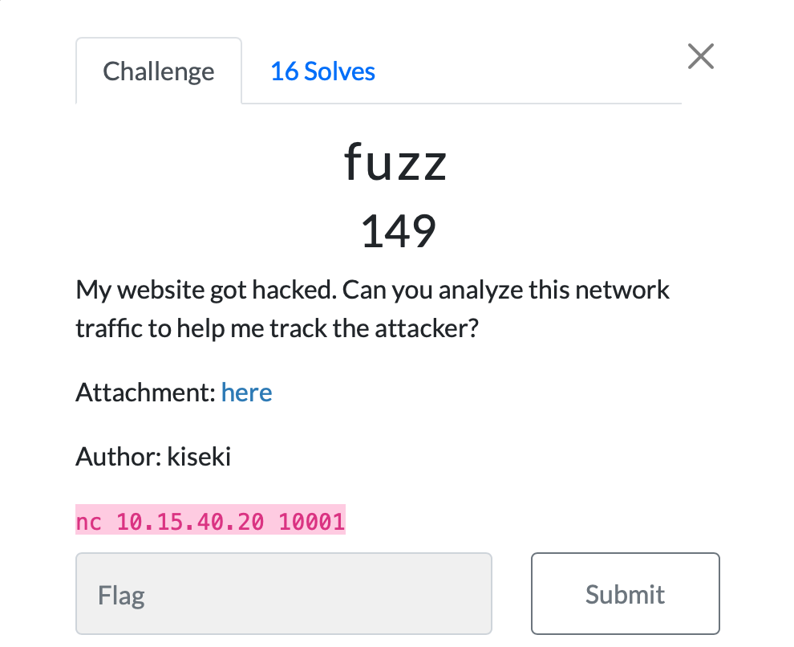

# Jarkom-Modul-1-IT09-2024

| Nama | NRP |
|---------|---------|
| Gavriel Pramuda Kurniaadi | 5027221031  |
| Stephanie Hebrina Mabunbun Simatupang | 5027221069  | 

## 1. Creds

 
Maksud soal : Kita diminta untuk mencari Username FTP yang digunakan oleh attacker & Password FTP yang digunakan oleh attacker
 
**Cara pengerjaan:**
1. Memfilter ftp && frame contains " Login " artinya untuk mencari yang Login saja, kemudian resultnya hanya keluar 1 yang succesfull

2. Kemudian klik Follow > TCP Stream, akan muncul seperti ini 

3. Kemudian akan muncul USER dan PASS nya

**Jika dimasukan ke netcat maka akan ketemu flagnya**

## 2. Evidence

## 3. Fuzz

## 4. ATM or ATP or FTP

 
Maksud soal : Kita diminta untuk mencari password yang berhasil didapatkan oleh hacker setelah melakukan bruteforce login ftp
 
**Cara pengerjaan:**
1. Memfilter ftp && frame contains " Login " artinya untuk mencari yang Login saja, kemudian resultnya hanya keluar 1 yang succesfull

2. Kemudian klik Follow > TCP Stream, akan muncul seperti ini 

**Jika dimasukan ke netcat maka akan ketemu flagnya**

## 5. How Many Packets?

 
Maksud soal : Kita diminta untuk menghitung total attempt login(bruteforce) yang dilakukan oleh hacker
 
**Cara pengerjaan:**
1. Memfilter ftp && frame contains " Login " artinya untuk mencari data yang pernah Login

2. Kemudian di kanan bawah ada tulisan "Displayed : 934", artinya yang total attemp login adalah 934 kali

**Jika dimasukan ke netcat maka akan ketemu flagnya**

## 6. Trace Him

 
Maksud soal : Kita diminta untuk mencari alamat IP Attacker
 

## 7. Malwaew

## 8. Malwleo

 
Maksud soal : Kita diminta untuk mencari nama malware yang dikirim oleh attacker melalui ftp
 
**Cara pengerjaan:**
1. Memfilter ftp && saat scroll akan ada Request: STOR m4L1c10us_W4re.c

**Jika dimasukan ke netcat maka akan ketemu flagnya**

## 9. Whoami

## 10. Secret

 
Maksud soal : Kita diminta untuk mencari file lainnya selain dari file malware
 
**Cara pengerjaan:**
1. Memfilter ftp-data

2. Download mirza.jpg
 

**Jika dimasukan ke netcat maka akan ketemu flagnya:**
